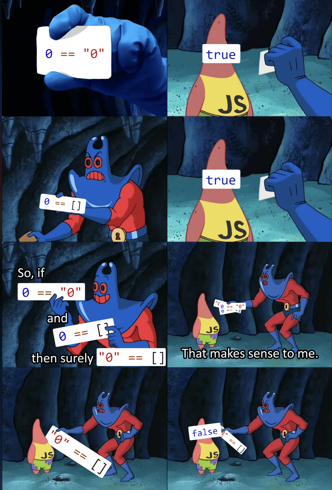

## Kapitel 2: Gleichheit in JavaScript

Video: https://youtu.be/yJvtzCFqmu0

Es gibt zwei arten von Vergleichen in JavaScript, `=== (strict equality)` und `== (loose equality)`.

Dabei prüft `strict equality` auf den Typ und den Wert der Variablen. Es führt keine automatische Typconversion aus.
Dies ist bei `loose equality` anders. Es verwendet nur den Wert der Variablen. Deshalb führt es automatische Typconversion aus, bis es bei beiden Seiten des Vergleiches auf den gleichen Typ kommt oder runter auf ein primitive. 
Regel: `object` wird zu einem `primitive` konvertiert mit dem Aufruf von `valueof()`, wenn es dann ein `primitive` ist dann wird verglichen sonst ein `toString()` Aufruf. 
`boolean` und `string` wird zur `number` konvertiert. 

`string` wird zu einem `int` konvertiert mit `Number()`:
```js
'5' == 5      // true da Number('5') → 5 == 5
'5.5' == 5.5  // true da Number('5.5') → 5.5 == 5.5
'five' == 5   // false da Number('five') → NaN
```

`boolean` wird zu einem `int` konvertiert:
```js
true == 1     // true da Number(true) → 1 == 1
false == 0    // true Number(false) → 0 == 0
true == 2     // false Number(true) → 1 ≠ 2
```

Leere Strings werden zu einem `int` Konvertiert das ergibt den Default Wert von 0
```js
'' == 0       // true da Number('') → 0 == 0
' ' == 0      // true da Number(' ') → 0 == 0
```

Unterschiedliche Datentypen werden beide zu `int` konvertiert. Dabei wird auf dem Array zuerst `toString()` aufgerufen und dann ein konvertiert zu `int`
```js
[] == false     // true ([] → '' → 0, false → 0)
[0] == false    // true ([0] → '0' → 0, false → 0)
[null] == false // true ([null] → '' → 0)
```

Jetzt kommen wir zum meme:



Warum gibt uns JS ein false aus bei Vergleicht zwischen "0" und []?
```js
console.log(0 == "0"); 
// 0 == Number("0") -> 0 == 0
console.log(0 == []);
// [].valueOf() -> [] also [].toString() -> "" -> 0 == "" -> 0 == Number("") 
console.log("0" == []);
// "0" == [].toString() -> [] also [].toString() -> "" also "0" == ""
```

Arrays verwenden `toString()` dann `Number()`.
```js
[1] == 1
// [1].toString() → '1' → '1' == 1 → 1 == 1 → true

[] == 0
// [].toString() → '' → '' == 0 → 0 == 0 → true

[1,2] == '1,2'
// [1,2].toString() → '1,2' → '1,2' == '1,2' → true
```

Bei `objecs` wird zuerst `valueOf()` verwendet.
```js
const obj = {
  valueOf() { return 42; }
};

obj == 42
// valueOf() → 42 → 42 == 42 → true
```

Wenn `valueOf()` ein `object` zurück gibt dann wird stattdessen `toString()` verwendet:
```js
const obj = {
  valueOf() { return {}; },
  toString() { return '123'; }
};

obj == 123
// valueOf() → not a primitive
// toString() → '123' → '123' == 123 → 123 == 123 → true
```

## Kapitel 3: Funktionen

In `javascript` gibt es mehrere Arten der Funktionsdefinition.
